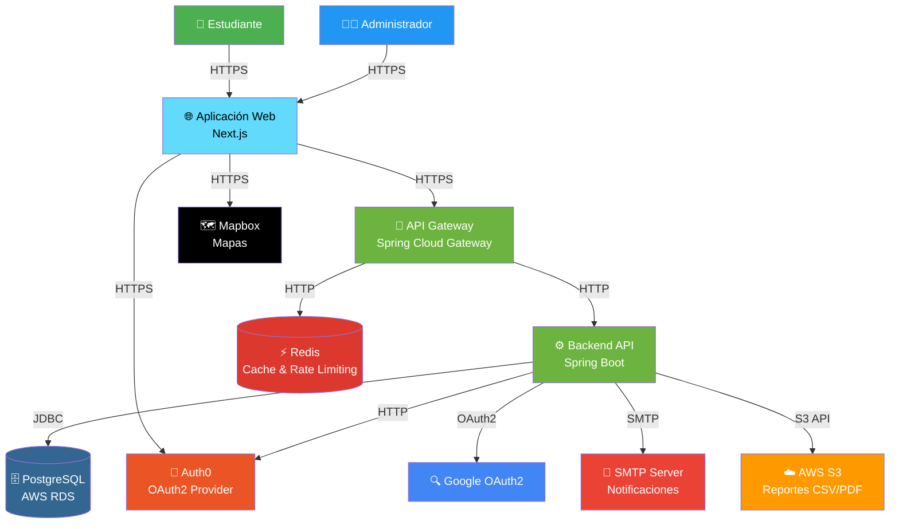
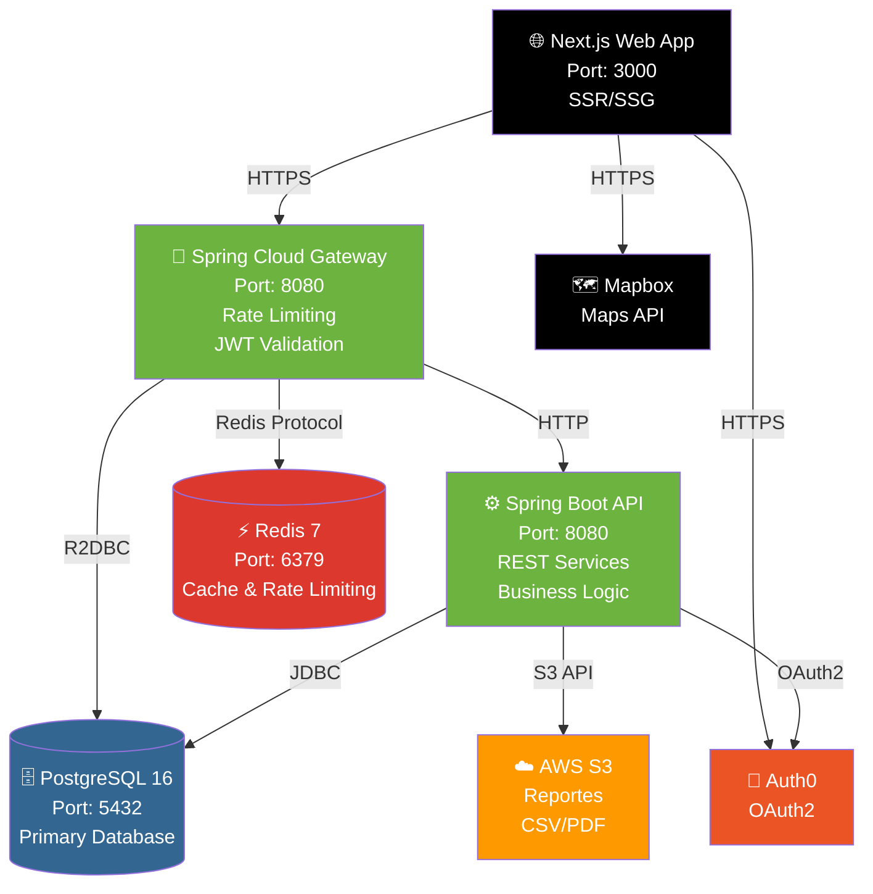
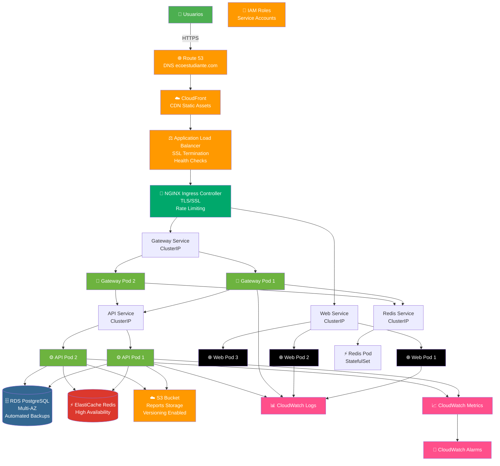

# 🌱 EcoEstudiante

<div align="center">


**Plataforma educativa para el cálculo y seguimiento de huella de carbono estudiantil con gamificación**

[Características](#-características) • [Arquitectura](#-arquitectura) • [Tecnologías](#-stack-tecnológico) • [Despliegue](#-despliegue) • [Documentación](#-documentación)

</div>

---

## 📋 Tabla de Contenidos

- [Descripción del Proyecto](#-descripción-del-proyecto)
- [Características](#-características)
- [Arquitectura](#-arquitectura)
  - [Diagrama de Contexto (C4 Nivel 1)](#diagrama-de-contexto-c4-nivel-1)
  - [Diagrama de Contenedores (C4 Nivel 2)](#diagrama-de-contenedores-c4-nivel-2)
  - [Diagrama de Componentes (C4 Nivel 3)](#diagrama-de-componentes-c4-nivel-3)
  - [Arquitectura de Despliegue AWS EKS](#arquitectura-de-despliegue-aws-eks)
- [Stack Tecnológico](#-stack-tecnológico)
- [Funcionalidades Principales](#-funcionalidades-principales)
- [Despliegue](#-despliegue)
  - [Despliegue Local con Docker](#despliegue-local-con-docker)
  - [Despliegue en AWS EKS (Kubernetes)](#despliegue-en-aws-eks-kubernetes)
  - [Despliegue Local sin Docker](#despliegue-local-sin-docker)
- [Configuración](#-configuración)
- [Seguridad](#-seguridad)
- [Monitoreo y Observabilidad](#-monitoreo-y-observabilidad)
- [Pruebas](#-pruebas)
- [Desarrollo](#-desarrollo)
- [Contribución](#-contribución)
- [Licencia](#-licencia)

---

## 🎯 Descripción del Proyecto

**EcoEstudiante** es una plataforma web educativa diseñada para que estudiantes universitarios calculen, registren y reduzcan su huella de carbono personal. El sistema combina metodologías científicas de cálculo de emisiones (IPCC 2006, GHG Protocol, NCh-ISO 14064-1:2019) con técnicas de gamificación y psicología del comportamiento (Teoría COM-B, Self-Determination Theory) para motivar cambios sostenibles en el estilo de vida estudiantil.

### Objetivos Principales

- 🎓 **Educación Ambiental**: Concienciar a estudiantes sobre su impacto ambiental
- 📊 **Cálculo Preciso**: Utilizar factores de emisión validados científicamente
- 🎮 **Gamificación**: Motivar mediante misiones, XP, logros y tablas de clasificación
- 📈 **Seguimiento**: Proporcionar análisis histórico y tendencias de reducción
- 🔐 **Seguridad**: Cumplir con estándares OWASP ASVS y protección de datos (Ley 19.628, GDPR-like)

---

## ✨ Características

### 🧮 Cálculo de Huella de Carbono

- **Electricidad**: Cálculo basado en consumo kWh y factor de emisión nacional (SEN)
- **Transporte**: Múltiples modos (auto, bus, metro, bicicleta, caminar, avión)
- **Residuos**: Cálculo de emisiones por tipo de residuo y método de disposición
- **Factores Metodológicos**: Registro centralizado de factores de emisión (IPCC, GHG Protocol)

### 🎮 Sistema de Gamificación

- **Sistema de XP (Experiencia)**: Puntos ganados por acciones sostenibles
- **Misiones**: Desafíos temporales con objetivos de reducción
- **Tabla de Clasificación**: Rankings por XP, reducción de emisiones y logros
- **Perfil de Gamificación**: Historial de logros y estadísticas personales

### 📊 Panel de Administración

- **Gestión de Usuarios**: CRUD completo de estudiantes y administradores
- **Analytics Institucional**: Métricas agregadas, reportes CSV/PDF
- **Gestión de Factores**: Administración de factores de emisión metodológicos
- **Monitoreo de Sistema**: Health checks, métricas de rendimiento

### 🔐 Autenticación y Autorización

- **Dual Auth**: Soporte para JWT tradicional y Auth0 OAuth2
- **Roles**: Estudiante (STUDENT) y Administrador (ADMIN)
- **OAuth2**: Integración con Google y Auth0
- **Rate Limiting**: Protección contra abuso con Redis

### 📱 Interfaz de Usuario

- **Responsive Design**: Optimizado para móviles, tablets y desktop
- **Accesibilidad**: Cumplimiento WCAG 2.1 AA
- **PWA Ready**: Soporte para Progressive Web App
- **Mapas Interactivos**: Visualización de rutas de transporte con Mapbox

---

## 🏗️ Arquitectura

### Diagrama de Contexto (C4 Nivel 1)



### Diagrama de Contenedores (C4 Nivel 2)



### Diagrama de Componentes (C4 Nivel 3)

```mermaid
graph TD
    GatewayRouter[Route Handler]
    JWTFilter[JWT Authentication Filter]
    RateLimiter[Rate Limiting Filter]
    Auth0Filter[Auth0 User Auto-Create]
    AuthController[Auth Controller<br/>Login/Register/Refresh]
    CalcController[Calc Controller<br/>Carbon Calculations]
    StatsController[Stats Controller<br/>Statistics & Analytics]
    GamificationController[Gamification Controller<br/>XP/Missions/Leaderboard]
    AdminController[Admin Controller<br/>User Management]
    ReportsController[Reports Controller<br/>CSV/PDF Export]
    FactorsController[Factors Controller<br/>Emission Factors]
    AuthService[Auth Service<br/>JWT/Auth0/OAuth2]
    CalcService[Calc Service<br/>Emission Calculations]
    StatsService[Stats Service<br/>Aggregations]
    GamificationService[Gamification Service<br/>XP/Missions Logic]
    MissionService[Mission Service<br/>Mission Management]
    LeaderboardService[Leaderboard Service<br/>Rankings]
    AdminService[Admin Service<br/>User CRUD]
    ReportsService[Reports Service<br/>Report Generation]
    EmailService[Email Service<br/>Notifications]
    UserRepository[User Repository]
    CalcRepository[Calculation Repository]
    GamificationRepository[Gamification Repository]
    MissionRepository[Mission Repository]
    LeaderboardCacheRepository[Leaderboard Cache]
    FactorsRepository[Factors Repository]
    PostgreSQL[(PostgreSQL)]
    
    GatewayRouter --> JWTFilter
    GatewayRouter --> RateLimiter
    GatewayRouter --> Auth0Filter
    GatewayRouter --> AuthController
    GatewayRouter --> CalcController
    GatewayRouter --> StatsController
    GatewayRouter --> GamificationController
    GatewayRouter --> AdminController
    GatewayRouter --> ReportsController
    GatewayRouter --> FactorsController
    
    AuthController --> AuthService
    CalcController --> CalcService
    StatsController --> StatsService
    GamificationController --> GamificationService
    GamificationController --> MissionService
    GamificationController --> LeaderboardService
    AdminController --> AdminService
    ReportsController --> ReportsService
    
    AuthService --> UserRepository
    CalcService --> CalcRepository
    StatsService --> CalcRepository
    GamificationService --> GamificationRepository
    MissionService --> MissionRepository
    LeaderboardService --> LeaderboardCacheRepository
    AdminService --> UserRepository
    ReportsService --> CalcRepository
    ReportsService --> UserRepository
    
    UserRepository --> PostgreSQL
    CalcRepository --> PostgreSQL
    GamificationRepository --> PostgreSQL
    MissionRepository --> PostgreSQL
    LeaderboardCacheRepository --> PostgreSQL
    FactorsRepository --> PostgreSQL
    
    style GatewayRouter fill:#6DB33F,color:#fff
    style AuthController fill:#2196F3,color:#fff
    style CalcController fill:#2196F3,color:#fff
    style GamificationController fill:#2196F3,color:#fff
    style AdminController fill:#FF9800,color:#fff
    style AuthService fill:#4CAF50,color:#fff
    style CalcService fill:#4CAF50,color:#fff
    style GamificationService fill:#4CAF50,color:#fff
```



### Arquitectura de Despliegue AWS EKS



---

## 🛠️ Stack Tecnológico

### Frontend

| Tecnología | Versión | Propósito |
|------------|---------|-----------|
| **Next.js** | 15.5.5 | Framework React con SSR/SSG |
| **React** | 19.1.0 | Biblioteca UI |
| **TypeScript** | 5.x | Tipado estático |
| **Tailwind CSS** | 4.x | Framework CSS utility-first |
| **Material-UI (MUI)** | 7.3.5 | Componentes UI |
| **NextUI** | 2.6.11 | Componentes UI adicionales |
| **Mapbox GL** | 3.16.0 | Mapas interactivos |
| **Recharts / ECharts** | 3.3.0 / 5.6.0 | Visualización de datos |
| **Auth0 Next.js SDK** | 3.3.0 | Autenticación OAuth2 |
| **Framer Motion** | 11.18.2 | Animaciones |
| **Next PWA** | 5.6.0 | Progressive Web App |

### Backend

| Tecnología | Versión | Propósito |
|------------|---------|-----------|
| **Java** | 17 | Lenguaje de programación |
| **Spring Boot** | 3.3.4 | Framework de aplicación |
| **Spring Cloud Gateway** | 2023.0.3 | API Gateway |
| **Spring Security** | 6.x | Seguridad y autenticación |
| **Spring Data JPA** | 3.x | Persistencia de datos |
| **Spring Data R2DBC** | 3.x | Acceso reactivo a BD (Gateway) |
| **JWT (jjwt)** | 0.12.5 | Tokens JWT |
| **Lombok** | Latest | Reducción de boilerplate |
| **Flyway** | 10.17.1 | Migraciones de base de datos |
| **SpringDoc OpenAPI** | 2.6.0 | Documentación API (Swagger) |
| **Micrometer + Prometheus** | Latest | Métricas y observabilidad |

### Base de Datos y Cache

| Tecnología | Versión | Propósito |
|------------|---------|-----------|
| **PostgreSQL** | 16 | Base de datos relacional principal |
| **Redis** | 7 | Cache y rate limiting |
| **Flyway** | 10.17.1 | Versionado de esquema |

### Infraestructura y DevOps

| Tecnología | Propósito |
|------------|-----------|
| **Docker** | Contenedorización |
| **Docker Compose** | Orquestación local |
| **Kubernetes** | Orquestación en producción |
| **Helm** | Gestión de charts K8s |
| **AWS EKS** | Kubernetes gestionado |
| **AWS RDS** | PostgreSQL gestionado |
| **AWS ElastiCache** | Redis gestionado |
| **AWS S3** | Almacenamiento de reportes |
| **AWS CloudWatch** | Logs, métricas y alertas |
| **AWS IAM** | Gestión de identidades |
| **AWS ALB** | Load balancer |
| **NGINX Ingress** | Ingress controller para K8s |

### Seguridad

| Estándar/Tecnología | Propósito |
|---------------------|-----------|
| **OWASP ASVS** | Estándar de seguridad API |
| **OWASP MASVS** | Estándar de seguridad móvil |
| **TLS 1.2+** | Cifrado en tránsito |
| **HSTS** | HTTP Strict Transport Security |
| **JWT (HS512)** | Autenticación stateless |
| **BCrypt/Argon2** | Hashing de contraseñas |
| **Rate Limiting** | Protección contra abuso |
| **SAST (CodeQL)** | Análisis estático de código |
| **DAST (OWASP ZAP)** | Análisis dinámico |

### Pruebas

| Tecnología | Propósito |
|------------|-----------|
| **JUnit 5** | Pruebas unitarias |
| **Spring Test** | Pruebas de integración |
| **Testcontainers** | Contenedores para testing |
| **Pact** | Contract testing |
| **Jest** | Pruebas frontend |
| **Testing Library** | Pruebas de componentes React |
| **k6** | Pruebas de carga |
| **Cypress/Playwright** | Pruebas E2E |

### Monitoreo y Observabilidad

| Tecnología | Propósito |
|------------|-----------|
| **Prometheus** | Métricas |
| **Grafana** | Visualización de métricas |
| **CloudWatch** | Logs y métricas AWS |
| **Micrometer** | Instrumentación de métricas |
| **Spring Actuator** | Health checks y métricas |

### Metodologías y Estándares

| Estándar | Propósito |
|----------|-----------|
| **IPCC 2006** | Factores de emisión |
| **GHG Protocol** | Estándar corporativo |
| **NCh-ISO 14064-1:2019** | Estándar nacional chileno |
| **ISO 25010** | Calidad de software |
| **ISO 29119** | Pruebas de software |
| **ISO 27001/27018/27701** | Seguridad y privacidad |
| **WCAG 2.1 AA** | Accesibilidad web |
| **SRE** | Site Reliability Engineering |

---

## 🎯 Funcionalidades Principales

### 1. Cálculo de Huella de Carbono

#### Electricidad
- Registro de consumo mensual en kWh
- Cálculo automático usando factor de emisión nacional (SEN)
- Historial de consumo y tendencias

#### Transporte
- Múltiples modos: auto (gasolina/diesel/eléctrico/híbrido), moto, bus, metro, bicicleta, caminar, avión
- Cálculo basado en distancia y factor de emisión por modo
- Visualización de rutas en mapas interactivos (Mapbox)
- Registro de viajes con origen y destino

#### Residuos
- Cálculo por tipo de residuo (orgánico, reciclable, no reciclable)
- Consideración del método de disposición
- Factores de emisión específicos por tipo

### 2. Sistema de Gamificación

#### Sistema de XP (Experiencia)
- Puntos ganados por:
  - Registrar cálculos de huella
  - Completar misiones
  - Reducir emisiones
  - Racha de días consecutivos

#### Misiones
- **Misiones Activas**: Desafíos en curso con objetivos de reducción
- **Misiones Disponibles**: Nuevas misiones que el usuario puede iniciar
- **Misiones Completadas**: Historial de logros
- **Misiones Expiradas**: Misiones no completadas a tiempo
- Tipos de misiones:
  - Reducción de emisiones (electricidad, transporte, residuos)
  - Consistencia (días consecutivos)
  - Logros especiales

#### Tabla de Clasificación
- Rankings globales por:
  - Total de XP
  - Mayor reducción de emisiones
  - Misiones completadas
- Cache optimizado para rendimiento
- Actualización periódica mediante jobs programados

#### Perfil de Gamificación
- Balance actual de XP
- Historial de transacciones de XP
- Estadísticas de misiones
- Logros desbloqueados

### 3. Panel de Administración

#### Gestión de Usuarios
- Listado paginado de usuarios
- Búsqueda y filtrado
- Creación, edición y eliminación
- Asignación de roles (STUDENT, ADMIN)
- Visualización de perfil completo

#### Analytics Institucional
- Métricas agregadas:
  - Total de estudiantes
  - Total de cálculos registrados
  - Emisiones totales calculadas
  - Reducción promedio
- Reportes exportables:
  - CSV para análisis
  - PDF para presentaciones
- Almacenamiento en AWS S3

#### Gestión de Factores de Emisión
- CRUD de factores metodológicos
- Validación según estándares (IPCC, GHG Protocol)
- Versionado de factores

### 4. Autenticación y Autorización

#### Autenticación Dual
- **JWT Tradicional**: Login/registro con email y contraseña
- **Auth0 OAuth2**: Autenticación federada
- **Google OAuth2**: Login con cuenta de Google
- Refresh tokens para renovación automática

#### Roles y Permisos
- **STUDENT**: Acceso a dashboard, cálculos, gamificación
- **ADMIN**: Acceso completo + panel de administración

#### Seguridad
- Rate limiting por IP/usuario
- Validación de JWT en Gateway
- Auto-creación de usuarios Auth0 en BD
- Hashing seguro de contraseñas (BCrypt)

### 5. Estadísticas y Reportes

#### Dashboard Personal
- Resumen de huella de carbono actual
- Gráficos de tendencias históricas
- Comparación con promedios
- Progreso de misiones activas

#### Reportes Administrativos
- Exportación a CSV
- Exportación a PDF
- Almacenamiento en S3
- Filtros por fecha, usuario, tipo de cálculo

---

## 🚀 Despliegue

### Despliegue Local con Docker

#### Requisitos Previos

- Docker Desktop o Docker Engine 20.10+
- Docker Compose 2.0+
- 8 GB RAM mínimo
- 20 GB espacio en disco

#### Pasos de Despliegue

1. **Clonar el repositorio**
   ```bash
   git clone <repository-url>
   cd ecoestudiante
   ```

2. **Configurar variables de entorno**
   ```bash
   cp .env.example .env
   # Editar .env con tus configuraciones
   ```

3. **Ejecutar script de inicio automatizado (Recomendado)**
   ```bash
   chmod +x start.sh
   ./start.sh
   ```

   O manualmente:
   ```bash
   # Construir imágenes
   docker-compose build
   
   # Levantar servicios
   docker-compose up -d
   
   # Ver logs
   docker-compose logs -f
   ```

4. **Verificar servicios**
   ```bash
   docker-compose ps
   ```

5. **Acceder a la aplicación**
   - Web: http://localhost:3000
   - API Gateway: http://localhost:8888
   - Backend API: http://localhost:18080
   - Swagger UI: http://localhost:18080/swagger-ui.html
   - pgAdmin: http://localhost:5050

#### Opciones del Script

```bash
# Inicio normal (usa caché)
./start.sh

# Reconstruir sin caché
./start.sh --rebuild

# Limpiar todo y empezar desde cero
./start.sh --clean
```

### Despliegue en AWS EKS (Kubernetes)

#### Requisitos Previos

- AWS CLI configurado
- `kubectl` instalado
- `eksctl` o acceso a EKS cluster
- `helm` instalado (opcional)
- Credenciales AWS con permisos adecuados

#### 1. Preparar Infraestructura AWS

##### Crear EKS Cluster

```bash
# Usando eksctl (recomendado)
eksctl create cluster \
  --name ecoestudiante-cluster \
  --region us-east-1 \
  --nodegroup-name standard-workers \
  --node-type t3.medium \
  --nodes 3 \
  --nodes-min 2 \
  --nodes-max 5 \
  --managed

# O usando Terraform/CloudFormation
```

##### Crear RDS PostgreSQL

```bash
aws rds create-db-instance \
  --db-instance-identifier ecoestudiante-db \
  --db-instance-class db.t3.medium \
  --engine postgres \
  --engine-version 16 \
  --master-username eco \
  --master-user-password <SECURE_PASSWORD> \
  --allocated-storage 100 \
  --storage-type gp3 \
  --multi-az \
  --backup-retention-period 7 \
  --publicly-accessible false \
  --vpc-security-group-ids <SECURITY_GROUP_ID>
```

##### Crear ElastiCache Redis

```bash
aws elasticache create-cache-cluster \
  --cache-cluster-id ecoestudiante-redis \
  --engine redis \
  --cache-node-type cache.t3.micro \
  --num-cache-nodes 1 \
  --vpc-security-group-ids <SECURITY_GROUP_ID>
```

##### Crear S3 Bucket

```bash
aws s3 mb s3://ecoestudiante-reports-$(date +%s) \
  --region us-east-1

# Habilitar versionado
aws s3api put-bucket-versioning \
  --bucket ecoestudiante-reports-* \
  --versioning-configuration Status=Enabled
```

##### Configurar IAM Roles

```bash
# Crear IAM role para EKS service account
aws iam create-role \
  --role-name ecoestudiante-eks-role \
  --assume-role-policy-document file://trust-policy.json

# Adjuntar políticas necesarias
aws iam attach-role-policy \
  --role-name ecoestudiante-eks-role \
  --policy-arn arn:aws:iam::aws:policy/AmazonS3FullAccess
```

#### 2. Configurar Kubernetes Secrets

```bash
# Crear namespace
kubectl create namespace ecoestudiante

# Crear secret para base de datos
kubectl create secret generic db-credentials \
  --from-literal=username=eco \
  --from-literal=password=<DB_PASSWORD> \
  --namespace=ecoestudiante

# Crear secret para JWT
kubectl create secret generic jwt-secret \
  --from-literal=secret=<JWT_SECRET> \
  --namespace=ecoestudiante

# Crear secret para Auth0 (si se usa)
kubectl create secret generic auth0-credentials \
  --from-literal=issuer=<AUTH0_ISSUER> \
  --from-literal=client-id=<AUTH0_CLIENT_ID> \
  --from-literal=client-secret=<AUTH0_CLIENT_SECRET> \
  --namespace=ecoestudiante

# Crear secret para AWS (S3 access)
kubectl create secret generic aws-credentials \
  --from-literal=access-key-id=<AWS_ACCESS_KEY> \
  --from-literal=secret-access-key=<AWS_SECRET_KEY> \
  --namespace=ecoestudiante
```

#### 3. Desplegar con Helm (Recomendado)

```bash
# Crear chart structure
helm create ecoestudiante

# Editar values.yaml con configuraciones
# Luego instalar
helm install ecoestudiante ./ecoestudiante \
  --namespace ecoestudiante \
  --set database.host=<RDS_ENDPOINT> \
  --set redis.host=<ELASTICACHE_ENDPOINT> \
  --set s3.bucket=<S3_BUCKET_NAME>
```

#### 4. Desplegar con Manifiestos YAML

##### Deployment - Web

```yaml
# web-deployment.yaml
apiVersion: apps/v1
kind: Deployment
metadata:
  name: ecoestudiante-web
  namespace: ecoestudiante
spec:
  replicas: 3
  selector:
    matchLabels:
      app: ecoestudiante-web
  template:
    metadata:
      labels:
        app: ecoestudiante-web
    spec:
      containers:
      - name: web
        image: ghcr.io/ecoestudiante/web:latest
        ports:
        - containerPort: 3000
        env:
        - name: NEXT_PUBLIC_API_URL
          value: "https://api.ecoestudiante.com"
        - name: GATEWAY_BASE_URL
          value: "http://ecoestudiante-gateway:8080"
        resources:
          requests:
            memory: "512Mi"
            cpu: "250m"
          limits:
            memory: "1Gi"
            cpu: "500m"
        livenessProbe:
          httpGet:
            path: /
            port: 3000
          initialDelaySeconds: 30
          periodSeconds: 10
        readinessProbe:
          httpGet:
            path: /
            port: 3000
          initialDelaySeconds: 10
          periodSeconds: 5
---
apiVersion: v1
kind: Service
metadata:
  name: ecoestudiante-web
  namespace: ecoestudiante
spec:
  selector:
    app: ecoestudiante-web
  ports:
  - port: 80
    targetPort: 3000
  type: ClusterIP
```

##### Deployment - Gateway

```yaml
# gateway-deployment.yaml
apiVersion: apps/v1
kind: Deployment
metadata:
  name: ecoestudiante-gateway
  namespace: ecoestudiante
spec:
  replicas: 2
  selector:
    matchLabels:
      app: ecoestudiante-gateway
  template:
    metadata:
      labels:
        app: ecoestudiante-gateway
    spec:
      containers:
      - name: gateway
        image: ghcr.io/ecoestudiante/gateway:latest
        ports:
        - containerPort: 8080
        env:
        - name: SPRING_PROFILES_ACTIVE
          value: "kubernetes"
        - name: BACKEND_API_URL
          value: "http://ecoestudiante-api:8080"
        - name: SPRING_REDIS_HOST
          valueFrom:
            secretKeyRef:
              name: redis-credentials
              key: host
        - name: JWT_SECRET
          valueFrom:
            secretKeyRef:
              name: jwt-secret
              key: secret
        resources:
          requests:
            memory: "512Mi"
            cpu: "250m"
          limits:
            memory: "1Gi"
            cpu: "500m"
---
apiVersion: v1
kind: Service
metadata:
  name: ecoestudiante-gateway
  namespace: ecoestudiante
spec:
  selector:
    app: ecoestudiante-gateway
  ports:
  - port: 8080
    targetPort: 8080
  type: ClusterIP
```

##### Deployment - API

```yaml
# api-deployment.yaml
apiVersion: apps/v1
kind: Deployment
metadata:
  name: ecoestudiante-api
  namespace: ecoestudiante
spec:
  replicas: 2
  selector:
    matchLabels:
      app: ecoestudiante-api
  template:
    metadata:
      labels:
        app: ecoestudiante-api
    spec:
      containers:
      - name: api
        image: ghcr.io/ecoestudiante/api:latest
        ports:
        - containerPort: 8080
        env:
        - name: SPRING_PROFILES_ACTIVE
          value: "kubernetes"
        - name: SPRING_DATASOURCE_URL
          value: "jdbc:postgresql://<RDS_ENDPOINT>:5432/ecoestudiante"
        - name: SPRING_DATASOURCE_USERNAME
          valueFrom:
            secretKeyRef:
              name: db-credentials
              key: username
        - name: SPRING_DATASOURCE_PASSWORD
          valueFrom:
            secretKeyRef:
              name: db-credentials
              key: password
        - name: JWT_SECRET
          valueFrom:
            secretKeyRef:
              name: jwt-secret
              key: secret
        resources:
          requests:
            memory: "1Gi"
            cpu: "500m"
          limits:
            memory: "2Gi"
            cpu: "1000m"
        livenessProbe:
          httpGet:
            path: /actuator/health
            port: 8080
          initialDelaySeconds: 60
          periodSeconds: 10
        readinessProbe:
          httpGet:
            path: /actuator/health/readiness
            port: 8080
          initialDelaySeconds: 30
          periodSeconds: 5
---
apiVersion: v1
kind: Service
metadata:
  name: ecoestudiante-api
  namespace: ecoestudiante
spec:
  selector:
    app: ecoestudiante-api
  ports:
  - port: 8080
    targetPort: 8080
  type: ClusterIP
```

##### Ingress

```yaml
# ingress.yaml
apiVersion: networking.k8s.io/v1
kind: Ingress
metadata:
  name: ecoestudiante-ingress
  namespace: ecoestudiante
  annotations:
    kubernetes.io/ingress.class: nginx
    cert-manager.io/cluster-issuer: letsencrypt-prod
    nginx.ingress.kubernetes.io/ssl-redirect: "true"
    nginx.ingress.kubernetes.io/rate-limit: "100"
spec:
  tls:
  - hosts:
    - ecoestudiante.com
    - api.ecoestudiante.com
    secretName: ecoestudiante-tls
  rules:
  - host: ecoestudiante.com
    http:
      paths:
      - path: /
        pathType: Prefix
        backend:
          service:
            name: ecoestudiante-web
            port:
              number: 80
  - host: api.ecoestudiante.com
    http:
      paths:
      - path: /
        pathType: Prefix
        backend:
          service:
            name: ecoestudiante-gateway
            port:
              number: 8080
```

##### Aplicar Manifiestos

```bash
# Aplicar todos los deployments
kubectl apply -f web-deployment.yaml
kubectl apply -f gateway-deployment.yaml
kubectl apply -f api-deployment.yaml
kubectl apply -f ingress.yaml

# Verificar estado
kubectl get pods -n ecoestudiante
kubectl get services -n ecoestudiante
kubectl get ingress -n ecoestudiante
```

#### 5. Configurar Auto-scaling

```yaml
# hpa.yaml
apiVersion: autoscaling/v2
kind: HorizontalPodAutoscaler
metadata:
  name: ecoestudiante-api-hpa
  namespace: ecoestudiante
spec:
  scaleTargetRef:
    apiVersion: apps/v1
    kind: Deployment
    name: ecoestudiante-api
  minReplicas: 2
  maxReplicas: 10
  metrics:
  - type: Resource
    resource:
      name: cpu
      target:
        type: Utilization
        averageUtilization: 70
  - type: Resource
    resource:
      name: memory
      target:
        type: Utilization
        averageUtilization: 80
```

#### 6. Configurar CloudWatch Logs

```yaml
# fluentd-configmap.yaml (ejemplo con Fluentd)
apiVersion: v1
kind: ConfigMap
metadata:
  name: fluentd-config
  namespace: ecoestudiante
data:
  fluent.conf: |
    <source>
      @type tail
      path /var/log/containers/*.log
      pos_file /var/log/fluentd-containers.log.pos
      tag kubernetes.*
      read_from_head true
      <parse>
        @type json
      </parse>
    </source>
    <match kubernetes.**>
      @type cloudwatch_logs
      log_group_name /aws/eks/ecoestudiante-cluster
      log_stream_name ${tag}
      auto_create_stream true
      region us-east-1
    </match>
```

#### 7. Verificar Despliegue

```bash
# Ver pods
kubectl get pods -n ecoestudiante

# Ver logs
kubectl logs -f deployment/ecoestudiante-api -n ecoestudiante

# Ver servicios
kubectl get svc -n ecoestudiante

# Probar conectividad
kubectl exec -it <pod-name> -n ecoestudiante -- curl http://ecoestudiante-api:8080/actuator/health
```

### Despliegue Local sin Docker

#### Requisitos Previos

- Java 17 JDK
- Node.js 18+ y npm
- PostgreSQL 16
- Redis 7
- Maven 3.8+

#### Pasos de Despliegue

1. **Configurar Base de Datos**

   ```bash
   # Crear base de datos
   createdb ecoestudiante
   
   # O usando psql
   psql -U postgres
   CREATE DATABASE ecoestudiante;
   ```

2. **Configurar Redis**

   ```bash
   # Iniciar Redis
   redis-server
   ```

3. **Configurar Backend API**

   ```bash
   cd ecoestudiante-api
   
   # Configurar application.yml con credenciales de BD
   # Editar src/main/resources/application.yml
   
   # ⚠️ IMPORTANTE: Configuración de Puerto
   # Si el puerto 8080 está ocupado en local, se recomienda usar el puerto 18080
   # Editar src/main/resources/application.yml o application.properties:
   #   server.port=18080
   # O establecer variable de entorno:
   #   export SERVER_PORT=18080
   
   # Compilar y ejecutar
   mvn clean install
   mvn spring-boot:run
   ```
   
   **Nota sobre puertos:**
   - **Puerto por defecto**: 8080
   - **Puerto alternativo recomendado**: 18080 (si 8080 está ocupado)
   - Para cambiar el puerto, edita `src/main/resources/application.yml`:
     ```yaml
     server:
       port: 18080  # Cambiar a 18080 si 8080 está ocupado
     ```
   - O usa variable de entorno:
     ```bash
     export SERVER_PORT=18080
     mvn spring-boot:run
     ```

4. **Configurar Gateway**

   ```bash
   cd ecoestudiante-gateway
   
   # Configurar application.yml
   # Editar src/main/resources/application.yml
   
   # ⚠️ IMPORTANTE: Si el Backend API está en puerto 18080, actualiza la URL:
   # En application.yml, configura:
   #   BACKEND_API_URL: http://localhost:18080
   # (Por defecto el Gateway espera el backend en 8080)
   
   # Compilar y ejecutar
   mvn clean install
   mvn spring-boot:run
   ```
   
   **Nota sobre configuración del Gateway:**
   - Si cambiaste el puerto del Backend API a 18080, asegúrate de actualizar la URL del backend en la configuración del Gateway
   - El Gateway debe apuntar al puerto correcto donde está corriendo el Backend API

5. **Configurar Frontend**

   ```bash
   cd ecoestudiante-web
   
   # Instalar dependencias
   npm install
   
   # Configurar variables de entorno
   cp ENV_AUTH0.example .env.local
   # Editar .env.local
   
   # Ejecutar en desarrollo
   npm run dev
   
   # O construir para producción
   npm run build
   npm start
   ```

---

## ⚙️ Configuración

### Configuración de Puertos

#### Backend API

**Puerto por defecto**: `8080`

**Si el puerto 8080 está ocupado**, se recomienda usar el puerto `18080`:

**Opción 1: Archivo de configuración**
```yaml
# src/main/resources/application.yml
server:
  port: 18080
```

**Opción 2: Variable de entorno**
```bash
export SERVER_PORT=18080
mvn spring-boot:run
```

**Opción 3: Línea de comandos**
```bash
mvn spring-boot:run -Dserver.port=18080
```

**⚠️ Importante**: Si cambias el puerto del Backend API a `18080`, asegúrate de actualizar la configuración del Gateway para que apunte al puerto correcto:

```yaml
# ecoestudiante-gateway/src/main/resources/application.yml
BACKEND_API_URL: http://localhost:18080
```

#### Gateway

**Puerto por defecto**: `8080`

El Gateway puede usar el mismo puerto 8080 si el Backend API está en 18080, o puedes configurarlo en otro puerto si es necesario.

#### Frontend

**Puerto por defecto**: `3000`

Si necesitas cambiar el puerto del frontend:
```bash
# En ecoestudiante-web
PORT=3001 npm run dev
```

### Variables de Entorno

#### Backend API (.env)

```bash
# Database
POSTGRES_DB=ecoestudiante
POSTGRES_USER=eco
POSTGRES_PASSWORD=<secure_password>

# JWT
JWT_SECRET=<min_64_characters_secret>

# Auth0 (Opcional)
AUTH0_ISSUER_BASE_URL=https://your-domain.auth0.com
AUTH0_AUDIENCE=https://api.ecoestudiante.com

# Email (Opcional)
MAIL_HOST=smtp.gmail.com
MAIL_PORT=587
MAIL_USERNAME=<your_email>
MAIL_PASSWORD=<app_password>

# AWS S3 (Producción)
AWS_ACCESS_KEY_ID=<your_key>
AWS_SECRET_ACCESS_KEY=<your_secret>
AWS_S3_BUCKET_NAME=ecoestudiante-reports
AWS_REGION=us-east-1
```

#### Frontend (.env.local)

```bash
# API Gateway URL
NEXT_PUBLIC_API_URL=http://localhost:8888

# Auth0 (Opcional)
AUTH0_SECRET=<random_32_char_string>
AUTH0_BASE_URL=http://localhost:3000
AUTH0_ISSUER_BASE_URL=https://your-domain.auth0.com
AUTH0_CLIENT_ID=<your_client_id>
AUTH0_CLIENT_SECRET=<your_client_secret>
AUTH0_AUDIENCE=https://api.ecoestudiante.com

# Mapbox (Opcional)
NEXT_PUBLIC_MAPBOX_TOKEN=<your_mapbox_token>
```

### Configuración de Base de Datos

Las migraciones de base de datos se gestionan automáticamente con Flyway al iniciar la aplicación. Las migraciones se encuentran en:

```
ecoestudiante-api/src/main/resources/db/migration/
```

### Configuración de Kubernetes

Para producción en Kubernetes, usar ConfigMaps y Secrets:

```bash
# Crear ConfigMap
kubectl create configmap app-config \
  --from-file=application.yml \
  --namespace=ecoestudiante

# Los secrets se crean como se mostró anteriormente
```

---

## 🔒 Seguridad

### Estándares de Seguridad

El proyecto cumple con:

- **OWASP ASVS Level 2**: Estándar de seguridad para APIs
- **OWASP MASVS**: Estándar de seguridad móvil (para futura app móvil)
- **ISO 27001/27018/27701**: Gestión de seguridad y privacidad

### Medidas de Seguridad Implementadas

1. **Autenticación**
   - JWT con algoritmo HS512
   - Refresh tokens con rotación
   - OAuth2 con Auth0
   - Hashing de contraseñas con BCrypt

2. **Autorización**
   - Control de acceso basado en roles (RBAC)
   - Validación de permisos en endpoints
   - Separación de rutas públicas y privadas

3. **Protección de Datos**
   - Cifrado en tránsito (TLS 1.2+)
   - HSTS habilitado
   - No almacenamiento de PII en logs
   - Minimización de datos

4. **Rate Limiting**
   - Implementado en Gateway con Redis
   - Límites por IP y por usuario
   - Protección contra DDoS

5. **Validación de Entrada**
   - Validación en frontend y backend
   - Sanitización de inputs
   - Protección contra SQL injection (JPA)

6. **Cumplimiento Legal**
   - Ley 19.628 (Chile): Protección de datos personales
   - Ley 21.459 (Chile): Delitos informáticos
   - Principios GDPR-like

### Auditoría de Seguridad

- **SAST**: CodeQL para análisis estático
- **DAST**: OWASP ZAP para análisis dinámico
- **Dependency Scanning**: Verificación de vulnerabilidades en dependencias
- **Penetration Testing**: Pruebas periódicas de penetración

---

## 📊 Monitoreo y Observabilidad

### Métricas

El sistema expone métricas Prometheus en `/actuator/prometheus`:

- **Latencia**: p50, p95, p99
- **Throughput**: Requests por segundo
- **Errores**: Tasa de errores HTTP
- **Disponibilidad**: Uptime y health checks
- **Recursos**: CPU, memoria, disco

### Logging

- **Estructurado**: Logs en formato JSON
- **Niveles**: DEBUG, INFO, WARN, ERROR
- **Agregación**: CloudWatch Logs (AWS) o ELK Stack
- **Retención**: 30 días (configurable)

### Alertas

Alertas configuradas en CloudWatch:

- Alta latencia (p95 > 1s)
- Alta tasa de errores (> 5%)
- Disponibilidad < 99.9%
- Uso de recursos > 80%

### Dashboards

Dashboards disponibles en Grafana/CloudWatch:

- **APM Dashboard**: Métricas de aplicación
- **Infrastructure Dashboard**: Métricas de infraestructura
- **Business Dashboard**: KPIs de negocio (MAU, cálculos, reducciones)

---

## 🧪 Pruebas

### Estrategia de Pruebas

```
┌─────────────────────────────────────┐
│         Pruebas E2E                 │
│    (Cypress/Playwright)            │
└─────────────────────────────────────┘
              ▲
┌─────────────────────────────────────┐
│      Pruebas de Integración         │
│    (Spring Test + Testcontainers)   │
└─────────────────────────────────────┘
              ▲
┌─────────────────────────────────────┐
│        Pruebas Unitarias            │
│    (JUnit 5 + Jest)                 │
└─────────────────────────────────────┘
```

### Ejecutar Pruebas

#### Backend

```bash
cd ecoestudiante-api

# Pruebas unitarias
mvn test

# Pruebas de integración
mvn verify

# Con cobertura
mvn test jacoco:report
```

#### Frontend

```bash
cd ecoestudiante-web

# Pruebas unitarias
npm test

# Con cobertura
npm run test:coverage

# Pruebas E2E (requiere servicios corriendo)
npm run test:e2e
```

#### Contract Testing (Pact)

```bash
# Ejecutar pruebas de contrato
cd ecoestudiante-web
npm run test:contract

# Publicar contratos
npm run pact:publish
```

### Cobertura de Código

- **Objetivo**: > 80% cobertura de líneas
- **Backend**: JaCoCo
- **Frontend**: Jest Coverage

---

## 💻 Desarrollo

### Estructura del Proyecto

```
ecoestudiante/
├── ecoestudiante-api/          # Backend Spring Boot
│   ├── src/main/java/
│   │   └── com/ecoestudiante/
│   │       ├── admin/          # Módulo de administración
│   │       ├── auth/           # Autenticación
│   │       ├── calc/           # Cálculos de huella
│   │       ├── factors/        # Factores de emisión
│   │       ├── gamification/   # Sistema de gamificación
│   │       └── reports/         # Reportes
│   └── src/main/resources/
│       └── db/migration/       # Migraciones Flyway
├── ecoestudiante-gateway/      # API Gateway
│   └── src/main/java/
│       └── com/ecoestudiante/gateway/
├── ecoestudiante-web/          # Frontend Next.js
│   ├── src/
│   │   ├── app/               # App Router (Next.js 13+)
│   │   ├── components/         # Componentes React
│   │   ├── lib/               # Utilidades
│   │   └── types/             # TypeScript types
│   └── public/                # Assets estáticos
├── docker-compose.yml          # Orquestación local
├── start.sh                   # Script de inicio
└── README.md                  # Este archivo
```

### Flujo de Desarrollo

1. **Crear rama de feature**
   ```bash
   git checkout -b feature/nueva-funcionalidad
   ```

2. **Desarrollar y probar localmente**
   ```bash
   ./start.sh
   # Hacer cambios
   # Ejecutar pruebas
   ```

3. **Commit y push**
   ```bash
   git add .
   git commit -m "feat: nueva funcionalidad"
   git push origin feature/nueva-funcionalidad
   ```

4. **Crear Pull Request**
   - Revisión de código
   - CI/CD ejecuta pruebas
   - Merge a `main`

### Convenciones de Código

- **Java**: Google Java Style Guide
- **TypeScript/React**: ESLint + Prettier
- **Commits**: Conventional Commits
- **Branches**: `feature/`, `fix/`, `docs/`, `refactor/`

---

## 🤝 Contribución

Las contribuciones son bienvenidas. Por favor:

1. Fork el proyecto
2. Crea una rama para tu feature (`git checkout -b feature/AmazingFeature`)
3. Commit tus cambios (`git commit -m 'feat: Add some AmazingFeature'`)
4. Push a la rama (`git push origin feature/AmazingFeature`)
5. Abre un Pull Request

### Guía de Contribución

- Seguir convenciones de código
- Agregar pruebas para nuevas funcionalidades
- Actualizar documentación
- Asegurar que todas las pruebas pasen

---

## 📄 Licencia

Este proyecto es propietario. Todos los derechos reservados.

### Licencias de Dependencias

Este proyecto utiliza las siguientes dependencias de código abierto y sus respectivas licencias:

#### Frontend

| Dependencia | Licencia | Versión |
|-------------|----------|---------|
| **Next.js** | MIT | 15.5.5 |
| **React** | MIT | 19.1.0 |
| **TypeScript** | Apache-2.0 | 5.x |
| **Tailwind CSS** | MIT | 4.x |
| **Material-UI (MUI)** | MIT | 7.3.5 |
| **NextUI** | MIT | 2.6.11 |
| **Mapbox GL** | BSD-2-Clause | 3.16.0 |
| **Recharts** | MIT | 3.3.0 |
| **ECharts** | Apache-2.0 | 5.6.0 |
| **Auth0 Next.js SDK** | MIT | 3.3.0 |
| **Framer Motion** | MIT | 11.18.2 |
| **Next PWA** | MIT | 5.6.0 |

#### Backend

| Dependencia | Licencia | Versión |
|-------------|----------|---------|
| **Spring Boot** | Apache-2.0 | 3.3.4 |
| **Spring Cloud Gateway** | Apache-2.0 | 2023.0.3 |
| **Spring Security** | Apache-2.0 | 6.x |
| **Spring Data JPA** | Apache-2.0 | 3.x |
| **Spring Data R2DBC** | Apache-2.0 | 3.x |
| **JWT (jjwt)** | Apache-2.0 | 0.12.5 |
| **Lombok** | MIT | Latest |
| **Flyway** | Apache-2.0 | 10.17.1 |
| **SpringDoc OpenAPI** | Apache-2.0 | 2.6.0 |
| **Micrometer** | Apache-2.0 | Latest |
| **PostgreSQL Driver** | BSD-2-Clause | Latest |
| **Testcontainers** | MIT | 1.20.1 |

#### Infraestructura

| Dependencia | Licencia | Versión |
|-------------|----------|---------|
| **Docker** | Apache-2.0 | Latest |
| **PostgreSQL** | PostgreSQL License | 16 |
| **Redis** | BSD-3-Clause | 7 |

#### Herramientas de Desarrollo

| Dependencia | Licencia | Versión |
|-------------|----------|---------|
| **JUnit 5** | EPL-2.0 | Latest |
| **Jest** | MIT | 29.7.0 |
| **ESLint** | MIT | 9.x |
| **Prettier** | MIT | Latest |

### Resumen de Licencias

- **MIT License**: La mayoría de las dependencias frontend y herramientas
- **Apache-2.0**: Spring Framework, JWT, Flyway, TypeScript
- **BSD-2-Clause / BSD-3-Clause**: PostgreSQL, Redis, Mapbox
- **PostgreSQL License**: Base de datos PostgreSQL (similar a MIT/BSD)

Todas las dependencias utilizadas son compatibles con el uso propietario del proyecto.

---

## 🚀 Roadmap: Tecnologías Planificadas para Producción

Este MVP (Minimum Viable Product) incluye las funcionalidades core y tecnologías esenciales para desarrollo y pruebas locales. Las siguientes tecnologías están planificadas para implementación en el paso a producción en AWS con Kubernetes:

### Infraestructura Cloud (AWS)

| Tecnología | Propósito | Prioridad | Fase |
|------------|-----------|-----------|------|
| **AWS EKS** | Kubernetes gestionado | Alta | Producción |
| **AWS RDS PostgreSQL** | Base de datos gestionada Multi-AZ | Alta | Producción |
| **AWS ElastiCache Redis** | Cache y rate limiting de alta disponibilidad | Alta | Producción |
| **AWS S3** | Almacenamiento de reportes CSV/PDF | Media | Producción |
| **AWS CloudWatch** | Logs, métricas y alertas centralizadas | Alta | Producción |
| **AWS IAM** | Gestión de identidades y permisos | Alta | Producción |
| **AWS ALB** | Application Load Balancer con SSL | Alta | Producción |
| **AWS Route 53** | DNS gestionado | Media | Producción |
| **AWS CloudFront** | CDN para assets estáticos | Baja | Post-Producción |

### Orquestación y Despliegue

| Tecnología | Propósito | Prioridad | Fase |
|------------|-----------|-----------|------|
| **Kubernetes** | Orquestación de contenedores | Alta | Producción |
| **Helm Charts** | Gestión de despliegues K8s | Alta | Producción |
| **NGINX Ingress Controller** | Ingress para K8s con TLS | Alta | Producción |
| **Horizontal Pod Autoscaler (HPA)** | Auto-escalado basado en métricas | Media | Producción |
| **Vertical Pod Autoscaler (VPA)** | Optimización de recursos | Baja | Post-Producción |

### Monitoreo y Observabilidad

| Tecnología | Propósito | Prioridad | Fase |
|------------|-----------|-----------|------|
| **Grafana** | Dashboards de visualización de métricas | Alta | Producción |
| **Prometheus Operator** | Gestión de Prometheus en K8s | Alta | Producción |
| **AWS CloudWatch Dashboards** | Dashboards personalizados | Media | Producción |
| **ELK Stack / OpenSearch** | Agregación y búsqueda de logs | Media | Post-Producción |
| **Jaeger / AWS X-Ray** | Distributed tracing | Baja | Post-Producción |

### Pruebas y Calidad

| Tecnología | Propósito | Prioridad | Fase |
|------------|-----------|-----------|------|
| **k6** | Pruebas de carga y estrés | Media | Pre-Producción |
| **Cypress / Playwright** | Pruebas E2E automatizadas | Media | Pre-Producción |
| **GitHub Actions / GitLab CI** | Pipeline CI/CD completo | Alta | Producción |
| **SonarQube** | Análisis de calidad de código | Media | Pre-Producción |

### Seguridad

| Tecnología | Propósito | Prioridad | Fase |
|------------|-----------|-----------|------|
| **CodeQL (SAST)** | Análisis estático de código | Alta | Pre-Producción |
| **OWASP ZAP (DAST)** | Análisis dinámico de seguridad | Alta | Pre-Producción |
| **Snyk / Dependabot** | Escaneo de vulnerabilidades en dependencias | Alta | Pre-Producción |
| **Argon2** | Hashing de contraseñas (alternativa a BCrypt) | Baja | Post-Producción |
| **AWS WAF** | Web Application Firewall | Media | Producción |
| **AWS Secrets Manager** | Gestión segura de secretos | Alta | Producción |
| **Cert-Manager** | Gestión automática de certificados TLS | Alta | Producción |

### Herramientas de Desarrollo

| Tecnología | Propósito | Prioridad | Fase |
|------------|-----------|-----------|------|
| **Prettier** | Formateo automático de código | Media | Desarrollo |
| **Husky** | Git hooks para calidad de código | Media | Desarrollo |
| **Commitlint** | Validación de mensajes de commit | Baja | Desarrollo |

### Notas Importantes

- **Prioridad Alta**: Tecnologías críticas para el despliegue en producción
- **Prioridad Media**: Tecnologías importantes pero no bloqueantes
- **Prioridad Baja**: Mejoras y optimizaciones futuras

- **Fase Pre-Producción**: Implementación antes del despliegue a producción
- **Fase Producción**: Implementación durante el despliegue inicial
- **Fase Post-Producción**: Mejoras continuas después del lanzamiento

### Estado Actual del MVP

✅ **Implementado y Funcional**:
- Desarrollo local con Docker Compose
- Backend Spring Boot con todas las funcionalidades core
- Frontend Next.js con UI completa
- Autenticación JWT y Auth0
- Base de datos PostgreSQL con Flyway
- Redis para rate limiting
- Pruebas unitarias e integración (JUnit, Jest, Pact)
- Documentación API (Swagger/OpenAPI)
- Métricas básicas (Micrometer/Prometheus)

⚠️ **Planificado para Producción**:
- Todas las tecnologías listadas en las tablas anteriores
- Infraestructura completa en AWS
- Monitoreo y observabilidad avanzada
- Pipeline CI/CD completo
- Seguridad reforzada

---

## 📞 Contacto y Soporte

Para preguntas, sugerencias o soporte:

- **Desarrollador**: [@HectorCano1411](https://github.com/HectorCano1411)
- **Email**: EcoEstudiante7@gmail.com
- **Repositorio**: [GitHub Repository](https://github.com/HectorCano1411/ecoestudiante)
- **Issues**: [GitHub Issues](https://github.com/HectorCano1411/ecoestudiante/issues)

---

<div align="center">

**Desarrollado con ❤️ para un futuro más sostenible**

🌱 **EcoEstudiante** - Calculando el cambio, un estudiante a la vez

</div>
